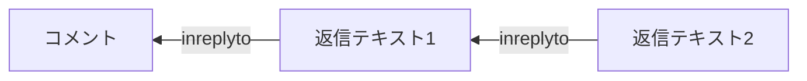
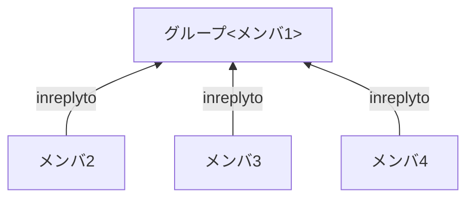

# XFDFファイルフォーマット(コメント)

`<annots>` の子要素としてコメント要素を配置する。

```xml
    <?xml version="1.0" encoding="UTF-8"?>
    <xfdf xmlns="http://ns.adobe.com/xfdf/" xml:space="preserve">
        <annots>
            ...
        </annots>
        ...
    </xfdf>
```

主なコメント要素には次の種類がある。

* [テキストの校正](format_xfdf_proof.md)
  * テキストに修飾
    * ハイライト表示 `<highlight>`
    * 下線 `<underline>`
    * 波下線 `<squiggly>`
    * 取り消し線 `<strikeout>`
  * 文字間に修飾
    * 挿入テキスト `<caret>`
* [テキスト](format_xfdf_text.md)
  * ノート注釈 `<text>`
  * テキスト注釈・テキストボックス・引き出し線付きテキストボックス `<freetext>`
* [描画ツール](format_xfdf_figure.md)
  * 線・矢印線 `<line>`
  * 四角形 `<square>`
  * 円・楕円 `<circle>`
  * 多角形 `<polygon>`
  * 折れ線 `<polyline>`
  * 自由曲線 `<ink>`
* [スタンプ](format_xfdf_stamp.md) `<stamp>`
* [埋め込みオブジェクト](format_xfdf_embd.md)
  * 添付ファイル `<fileattachiment>`
  * サウンドデータ `<sound>`
* その他  
  `link`, `redact`,  
  `projection`, `movie`, `widget`, `screen`,  
  `printmark`, `trapnet`, `richmedia`, `3d`, `watermark`

---

## コメント要素の共通属性

コメント要素は、次の子要素または属性を持つことができる。

* 共通情報属性
  * `title` 属性(省略可)
  * `subject` 属性(省略可)
* 日付属性
  * `date` 属性
  * `createdate` 属性
* リプライ属性
  * `name` 属性
  * `inreplyto` 属性
  * `replyType` 属性
* ポップアップノート要素
* `name` 名前属性

---

## `title` 属性

コメントの作成者(注記記入者)を指定する。

## `subject` 属性

属性名が紛らわしいが、プロパティのタイトル欄は、`subject` 属性に指定する。  
通常は、コメントの種類が書かれる。何に使用するのかは不明。

---

## `date` 属性

コメントの変更日付を指定する。  
`2021年12月19日 19時16分24秒 +09:00`は、`"D:20211219191624+09'00'"` で表す。


## `createdate` 属性

コメントの作成日図家を指定する。  
`2021年12月19日 19時16分24秒 +09:00`は、`"D:20211219191624+09'00'"` で表す。

---

## `name` 属性

コメント要素は `inreplyto` 属性で指定した名前のコメント要素へのリプライとして扱う。  
一意な文字列を指定する。一般的には uuid バージョン4、バリアント1 が使用される。

uuid： `RRRRRRRR-RRRR-4RRR-rRRR-RRRRRRRRRRRR`

* R:乱数の値  
* r:下位2ビットをランスとした8,9,A,Bのどれか

```xml
    <text 
        name="65ba4fde-e993-45ab-8176-1f60177b948a" >
        <contents-richtext>
            テキスト
        </contents-richtext>
    </text>
```

## `inreplyto` 属性/`replyType` 属性

コメント要素は `inreplyto` 属性で指定した名前(`name`属性)のコメント要素へのリプライとして扱う。  
`replyType` 属性で、返信(省略)かグループ(`group`)かを指定する。

* `replyType`
  * 省略時は返信
  * `replyType="group"` グループ化(複数の注釈要素を1つとして扱う指定)

### 返信



```xml
    <text 
        name="65ba4fde-e993-45ab-8176-1f60177b948a" >
        <contents-richtext>
            コメント
        </contents-richtext>
    </text>

    <text 
        inreplyto="65ba4fde-e993-45ab-8176-1f60177b948a" 
        name="d3a51b32-240c-444a-94a9-ac97ccb23471" >
        <contents-richtext>
            返信テキスト１
        </contents-richtext>
    </text>

    <text 
        inreplyto="d3a51b32-240c-444a-94a9-ac97ccb23471" 
        name="..." >
        <contents-richtext>
            返信テキスト２
        </contents-richtext>
    </text>
    ...
```

### グループ

複数のコメントをグループ化し、1つのコメントとして扱う。



```xml
        <square name="メンバ1"  .../>
        <circle inreplyto="メンバ1"
                name="メンバ2" replyType="group" .../>
        <circle inreplyto="メンバ1"
                name="メンバ3" replyType="group".../>
        <circle inreplyto="メンバ1"
                name="メンバ4" replyType="group" .../>

```

---

## popup

* ポップアップノート `<popup>`

---

## ポップアップノート

* ポップアップノート `<popup>`

PDFビューアは、コメント要素を選択した場合、コメント内容をポップアップして表示する。  
コメント要素はポップアップノートを持つことができる。  
ポップアップノートは、ポップアップ表示位置を指定する。(省略可)

各コメント要素の子要素として `<popup ...>` を配置する。

* `flags` フラグ(複数ある場合はカンマ区切り)
  * `print`
  * `nozoom`
  * `norotate`
* `open` 表示状態(`no`:要求すると開く、`yes`:最初から開いている)
* `page` 表示するページ
* `rect` 表示する範囲

---

## 状態

注釈要素は状態を表示出来る。主にリプライ機能と併用する。  
`statemodel` 属性で状態モデルを指定し、`state`属性に状態を指定する。

### ステータス機能

`Review`モデルを使用する

* `statemodel="Review"`
  * `state="None"` なし
  * `state="Accepted"` 承認
  * `state="Cancelled"` キャンセル
  * `state="Completed"` 完了
  * `state="Rejected"` 却下

### チェックマーク機能

`Marked`モデルを使用する

* `statemodel="Marked"`
  * `state="Marked"` マーク設定
  * `state="Unmarked"` マーク解除

---

## コンテンツ

コンテンツはテキスト文章を持つ。コンテンツは2種類ある。

* コンテンツ `contents`  
  内包するデータは使用目的によって異なる。  
  テキストが目的ならば、特別な修飾されていない文字列を指定する。
* リッチテキストのコンテンツ `contents-richtext`  
  フォント指定や、文字色指定など簡単な表現を行ったテキストを指定する。  
  基本的には、XHTML のサブセットを使用する。

---

## そのほか

* [座標変換](format_xfdf_trans.md)

